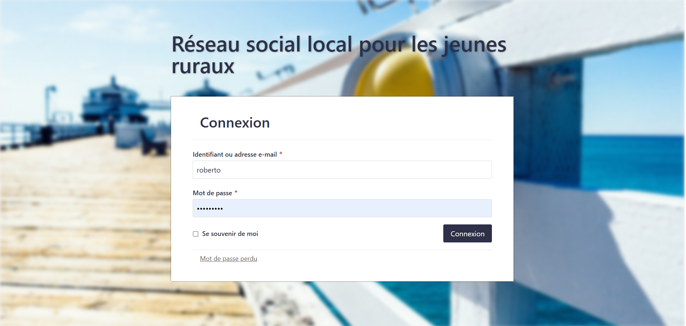
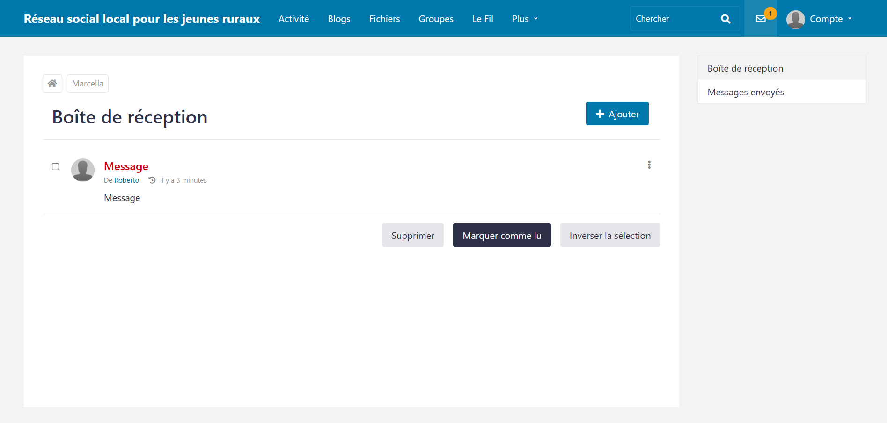
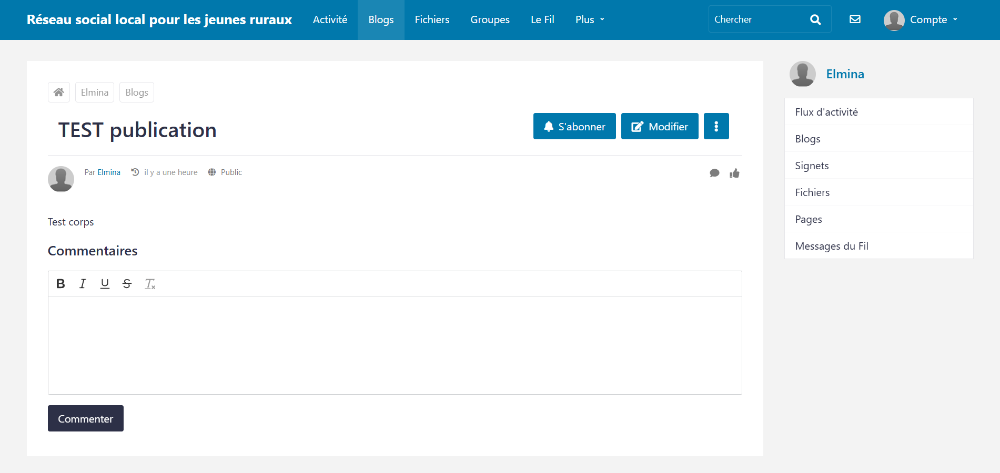

## Installation

- git clone https://github.com/ElminaRanaivo/projet8-reseau-social-local-pour-jeune-ruraux
- créer la base mysql et importer le fichier sql dans le dossier database
- mettre à jour le fichier elgg-config/settings.php

## Captures d'écran

### Authentification

### Message

### Publication.png

